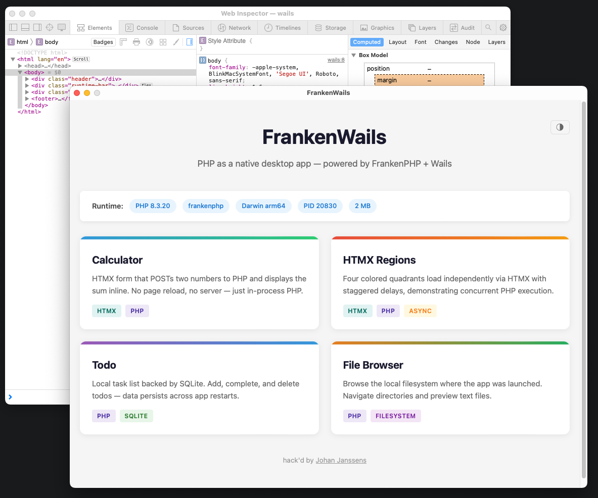

# FrankenWails

PHP as a native desktop app — FrankenPHP + Wails, no HTTP server.

FrankenWails embeds the PHP runtime directly inside a native desktop window using [FrankenPHP](https://frankenphp.dev) and [Wails](https://wails.io). There is **no HTTP server** — the WebView's requests are intercepted by Wails and routed to FrankenPHP in-process.



> **Note**: This is a companion repo for my FrankenPHP conference talks. It's meant as inspiration and a reference implementation, not a production framework. Feel free to explore, fork, and adapt the patterns for your own projects. Links to talks and slides will be added here.

### Talks

- [Building Desktop Apps with PHP](https://confoo.ca/en/2025/session/building-desktop-apps-with-php) ([slides](https://gamma.app/docs/Building-Desktop-Apps-with-PHP-Confoo-2025-zeyd7c4qykll78b)) — ConFoo 2025
- [Building Native Desktop Apps with PHP](https://phptek.io/) — php[tek] 2026

## How It Works

```
WebView navigates to /index.php
    → Wails AssetServer intercepts (no TCP, no network)
    → Go http.Handler routes to FrankenPHP
    → PHP executes the script
    → HTML response rendered in WebView
```

The WebView thinks it's making HTTP requests, but they're just function calls to Go. No port, no socket, no network stack involved.

## Quick Start

### 1. Build PHP

FrankenWails embeds PHP as a static library via CGO. The included build system uses [static-php-cli](https://static-php.dev) to compile PHP 8.3 with extensions:

```bash
make php     # Downloads static-php-cli + builds PHP (first time takes a while)
```

This produces `dist/.php/buildroot/` with `libphp.a`, headers, and extensions.

### 2. Build & Run

```bash
make build   # Build the binary (dist/frankenwails)
make run     # Build + launch the desktop app
```

The Makefile resolves CGO flags automatically from `build/php`. If an `env.yaml` exists (e.g., pointing to an external PHP build), flag resolution is skipped.

The build uses the `nowatcher` tag to disable FrankenPHP's file watcher, avoiding the need to build its C++ dependency.

### GoLand

Generate an `env.yaml` with the correct CGO flags for your system:

```bash
make env     # Auto-generates env.yaml from the PHP build
```

Then configure GoLand to load `env.yaml` as environment variables.

## Demos

| Demo | Description |
|------|-------------|
| **Calculator** | HTMX form posting to PHP — inline addition without page reload |
| **HTMX Regions** | Four regions loading concurrently with staggered PHP sleep() delays |
| **Todo** | SQLite-backed task list with add, complete, and delete |
| **File Browser** | Browse the local filesystem, navigate directories, preview text files |

## Project Structure

```
frankenwails/
├── main.go              # Wails app + FrankenPHP initialization
├── build/php/           # PHP build system (static-php-cli)
├── examples/            # PHP pages (document root)
│   ├── index.php        # Landing page with demo cards
│   ├── calculator/      # HTMX calculator demo
│   ├── htmx/            # Concurrent regions demo
│   ├── todo/            # SQLite todo app
│   └── files/           # Local file browser
├── Makefile
├── go.mod
├── LICENSE.md
└── CLAUDE.md
```

## Requirements

- Go 1.26+
- [FrankenPHP](https://frankenphp.dev) (built automatically via `make php`)
- [Wails v2](https://wails.io)
- macOS, Linux, or Windows

## License

Code is MIT — see [LICENSE.md](LICENSE.md). The [talk material](talk.md) is licensed under [CC BY 4.0](https://creativecommons.org/licenses/by/4.0/) — free to share and adapt with attribution.

